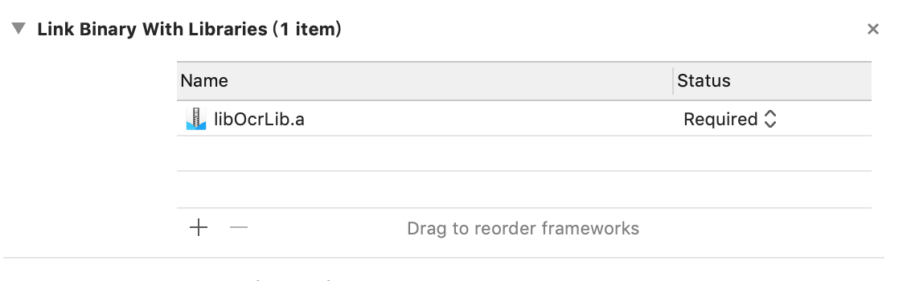
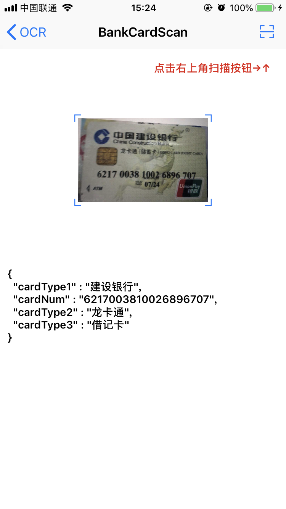

#OCR扫描

##github下载地址
<https://github.com/China-Love/OcrScan>

##初始化
```
    // 在AppDelegate里 导入OCR.h 并初始化OCR
    [OCR StartInit];
```
##集成注意点



##Demo功能如下图





##如有疑问请联系
$\color{green}{QQ}{ : 820649600}$


